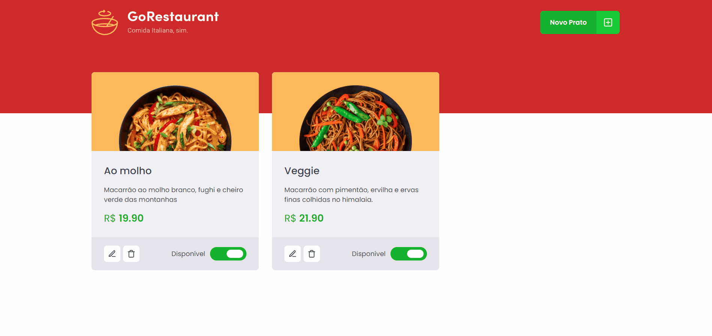

<div align="center">
  
  <!-- <h1>GoRestaurant</h1> -->
</div>

<p><b>GoRestaurant</b> é uma aplicação fictícia que nos possibilita cadastrarmos diversos tipos de pratos em um menu virtual.
<br />É possível adicionarmos um novo prato, atualizarmos as informações de um prato já existente e também excluirmos um prato já cadastrado.</p>

<h2>Desafio - Refactoring de classes e TypeScript</h2>

<p>Refatorando uma aplicação que utiliza class components e Javascript, aplicando uma estratégia mais moderna, com <b>function components</b> e tipagem com <b>Typescript.</b></p>

## 🎥 Projeto

<div align="center">
  
</div>

## 🧰 Tecnologias e Bibliotecas

- [ReactJS](https://pt-br.reactjs.org/tutorial/tutorial.html)
  - [styled-components](https://styled-components.com/)
  - [Axios](https://www.npmjs.com/package/axios)
  - [yup](https://github.com/jquense/yup)
- [TypeScript](https://www.typescriptlang.org/)

### Tools para criar API Fake

- [JSON Server](https://www.npmjs.com/package/json-server)

## ⚙️ Rodando o Projeto

```bash
# Clone este repositório para a pasta anterior
$ git clone https://github.com/diogomfc/GoRestaurant.git
# ou use a opção de download.

# Acesse a pasta RocketShoes
$ cd GoRestaurant

# Instale as dependências
$ yarn install
ou
$ npm install

# Executando o server
$ yarn server
ou
$ npm server

# Executando o Projeto
$ yarn start
ou
$ npm start

# Acesse http://localhost:3000 no seu navegador
```

<div align="center">
  <small>Diogo Silva - 2021</small>
</div>
